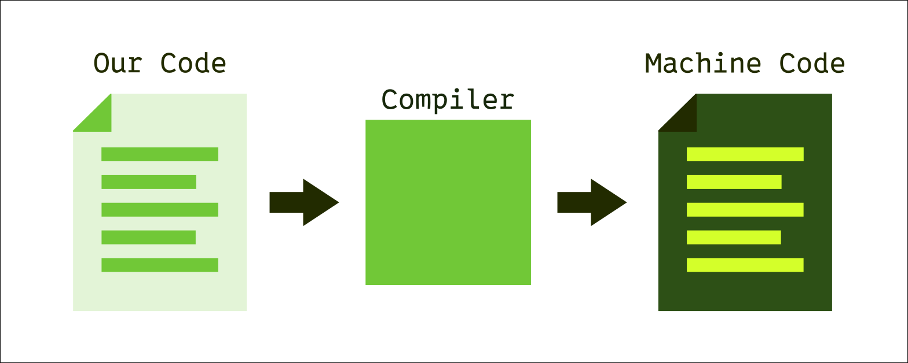
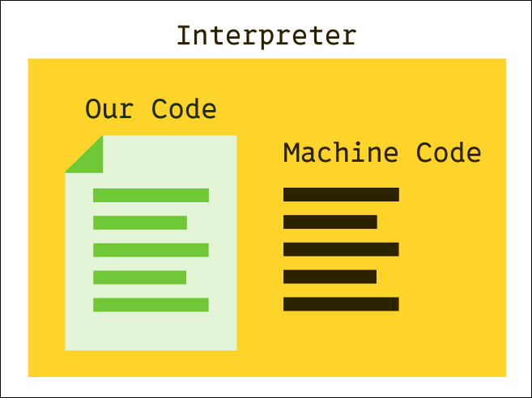

## What Is Programming?

JavaScript is the programming language most commonly associated with web development, but what is a programming language, and what is programming? Fundamentally, programming is the act of providing structured instructions to a computer so that it can carry out various tasks. Programming languages are a set of rules that allow us to give a computer instructions.

### How Does Programming Work?

When a computer is designed and manufactured, it is physically hard-coded with an instruction set. The instruction set is the fundamental list of instructions which the computer understands. However, programmers rarely write their programs directly with instruction set code. Instead, we use intermediate languages, programming languages, which we then translate into machine code. The process of translating our human written programs to instructions the computer can follow is called compilation.

Compilation is essentially a simple process; each line of code in our program is replaced by one or more corresponding instruction codes. In the early days of programming, this could be done by hand. But with the advent of more complex programming languages, we are much more likely to use a tool called a compiler.



As seen above, the compiler serves as a translator, taking in our code, and outputting machine code which can be executed by the computer.

### Interpreted Languages

Unlike the model above, some languages are not compiled into machine code. This means they cannot be run directly on a computer. Instead, they run inside a special environment that is capable of interpreting the programming language line-by-line. JavaScript is one such language; it can only run within a JavaScript runtime. The reason we are able to use JavaScript for web development is that there is a JavaScript runtime environment built into most browsers.



Here we can see that for interpreted languages like JavaScript, our code is taken by an interpreter, which itself is a program that has been compiled into machine code, and that the interpreter uses our code to send instructions to the computer.

The difference between compilation and interpretation can be thought of like this: in a compiled language, we are effectively communicating directly with the computer. This is like being in the driver's seat of a car. If we want to turn left, we simply turn the steering wheel to the left. On the other hand, programming in an interpreted language is like being in the passenger seat giving directions to the driver. We can still give instructions to turn left, but the driver, in this case the interpreter, is the one who turns the steering wheel for us.

## How Do We Program?

Now that we have a conceptual understanding of programming, how can we actually put it into practice? Well, since JavaScript is an interpreted language, we know that we need an interpreter or runtime environment to run our code. When we write code for our websites, the web browser's built-in runtime will suffice. But to start, we are going to be writing standalone programs that run outside of the browser, so instead of the browser runtime, we'll be using one called Node.

### Node JS

Node, or Node JS, is a JavaScript runtime that allows us to run our JavaScript files. We simply run the following command in the terminal:

```
node programName.js
```

Make sure your .js file's name matches what you type for the command.

### Our First Program

Once we've created a .js file, we can start writing some JavaScript code:

```
let x = 2;
let y = 5;
console.log(x + y);
```

Above is a short JS program. Let's break down what it does line-by-line.

```
let x = 2;
```

First, we use the `let` keyword, which means that we are creating a new variable. Think of a variable as a box in which we can store data. In this case, we are storing the number `2` in a variable that we named `x`.

```
let y = 5;
```

Next, we create a second variable called `y` and store the number `5` in it.

```
console.log(x + y)
```

Finally, we use the `console.log()` function to print the value of `x + y`. We know that `x` is equal to 2 and `y` is equal to 5, so `x + y` should be 7.

## JavaScript Basics

Here are some of the basic concepts which we'll need to know to write our own JS programs.

### Data Types

Much of programming involves taking data and doing something to that data. For example, we might take a user's name and store it into a database. In JavaScript, there are three basic data types:

- Numbers: These are self-explanatory. Any numbers, including whole numbers and decimal numbers, fall into this category. Examples: `5`, `100`, `3.1415`.
- Strings: Strings include any text data. They are called so because they consist of a "string" of characters. Strings are always enclosed in either single or double quotes. Examples: `"5"`, `"Hello`, `"The quick brown fox jumped over the lazy dog."`
- Booleans: There are only two fundamental boolean values: true and false. Just like a mathematical expression can be simplified into a number, a boolean expression can be simplified into either true or false. For example, `2 > 3` is a boolean expression which evaluates as false.

### Variables

We've seen that we can create variables using the `let` keyword. This process of creating a new variable is called declaration. We've also seen that we can use the equals symbol to store a data value in a variable. This process is called assignment. We can perform declaration and assignment in separate steps:

```
let myVariable;   // This is declaration
myVariable = "hello";   // This is assignment
```

Or, as we saw before, we can do them in a single line:

```
let myVariable = "hello";     // This is both declaration and assignment
```

Variables can also be re-assigned. This means assigning one value, and then later on assigning a different value to the same variable:

```
let myVariable = "hello";
...
myVariable = "goodbye";
```

Notice that we only use `let` when declaring a new variable, not when assigning to a variable that already exists.

### Constants

Constants are a special type of variable that can only be assigned once. In other words, the value we initially assign to the constant cannot change. This is useful when we have an important data value that we don't want to accidentally modify. We create constants like so:

```
const pi = 3.141592
```

As you can see, constants are created just like variables, except with the `const` keyword. Notice that we declare the constant and assign its value on the same line. Unlike variables, this is mandatory for constants, as they can only ever have a single value.

When should we use constants instead of variables? Simply, we should use constants whenever possible over variables; if we know that a variable will not need to be re-assigned at any point in our program, we should make it a constant. This is because constants are less prone to error, as we know that they will never change in value.

### Functions

Functions are snippets of code that we can write once and use over and over. Most functions take some data as an input and give back some data as an output. The data taken as input is often called the arguments of a function. Using a function is called calling it.

```
function add(number1, number2) {
    return number1 + number2;
}
```

Above we have a simple function. Just like we declare variables using `let`, we start function definitions with the `function` keyword. Then, we name our function. In this case, we name our function `add`. After the name, there are parentheses enclosing a list of parameters. These define what kind of arguments our function needs as input. In our case, we define our function as taking in two arguments, named `number1` and `number2`.

After our function declaration, we write the code for our function inside of curly braces `{}`. This is a short function with only one line: we tell our function to output a value using the `return` keyword, and set its output value to `number1 + number2`.

Now we can call our function:

```
const result = add(2, 5);
console.log(result);
```

Above, we declare a constant called `result` and assign to the constant the output of our function with the arguments `2` and `5`. Then we print the value of our result.

## Conclusion

We now know the basics of programming in JavaScript, including data types, variables, and functions. In future classes, we will continue to learn more programming concepts, such as looping and decision-making, and eventually we'll learn how to apply our programming skills to adding features to our websites.
